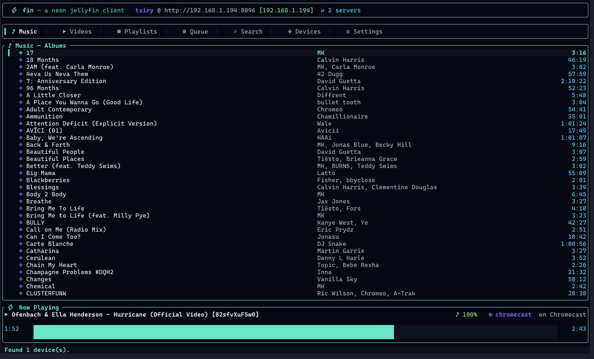

# fin

> a neon-electric Jellyfin client for the terminal — powered by `mpv` and Chromecast



`fin` is a Rust TUI + one-shot CLI that talks to your Jellyfin server, searches
your library, manages playlists, and pushes streams to either your local **mpv**
window or any **Chromecast** on your network. Chromecast playback is fully
queued — enqueue, play-next, skip, resume, all from the terminal.

## Features

- **Ratatui-based TUI** with a neon-electric palette (teal / cyan / violet).
- **fzf-style instant search** — results update on every keystroke.
- **Drill-in navigation** — Enter on an album lists its tracks, Enter on a
  series lists its episodes, Enter on a playlist lists its items. `x`
  plays the whole container in one go.
- **No list truncation** — Music, Videos, and Playlists fetch every item
  the server has, so nothing stays hidden past an arbitrary limit.
- **Two renderers**, one interface:
  - `mpv` (local) — spawned automatically and driven via its JSON IPC socket.
  - `chromecast` — device discovery via mDNS, playback through the Default
    Media Receiver, with a **local queue** that auto-advances on `FINISHED`.
- **Real queue management** — enqueue, play next, jump between tracks, and
  see the whole queue in its own tab. Works identically for both renderers.
- **Playlists** — browse, open, and play the playlists you've saved on the
  server.
- **Now Playing bar** with title, subtitle, elapsed / total time, a neon
  progress gauge, volume, and the active renderer.
- **CLI shortcuts** for scripting: `fin play "kind of blue"`,
  `fin queue --chromecast "Living Room" "wednesday"`, `fin devices`.
- **All settings** are available as **CLI flags _or_ TOML keys** — one
  workflow scales from ad-hoc invocation to per-machine config.
- **Pure Rust TLS** (`rustls`) everywhere — no OpenSSL required.

## Install

`fin` needs **`mpv`** on your `$PATH` at runtime. Every install path below
either bundles it or pulls it in as a dependency.

### macOS / Linux — Homebrew

```bash
brew install tsirysndr/tap/fin
```

The formula pulls in `mpv` automatically.

### Debian / Ubuntu — `.deb`

Download the `.deb` for your architecture from the
[latest release](https://github.com/tsirysndr/fin/releases/latest) and:

```bash
# amd64
curl -LO https://github.com/tsirysndr/fin/releases/latest/download/fin_0.1.0_amd64.deb
sudo apt install ./fin_0.1.0_amd64.deb

# arm64 (Raspberry Pi 4/5, Apple-silicon VM, …)
curl -LO https://github.com/tsirysndr/fin/releases/latest/download/fin_0.1.0_arm64.deb
sudo apt install ./fin_0.1.0_arm64.deb
```

`apt` will pull in `mpv` automatically as a dependency.

Or add the Gemfury apt repo once and `apt install` normally:

```bash
echo "deb [trusted=yes] https://apt.fury.io/tsirysndr/ /" \
  | sudo tee /etc/apt/sources.list.d/tsirysndr.list
sudo apt update && sudo apt install fin
```

### Fedora / RHEL / openSUSE — `.rpm`

```bash
sudo dnf install \
  https://github.com/tsirysndr/fin/releases/latest/download/fin-0.1.0-1.x86_64.rpm
```

Or via the Gemfury yum repo:

```bash
sudo tee /etc/yum.repos.d/tsirysndr.repo <<'EOF'
[tsirysndr]
name=tsirysndr
baseurl=https://yum.fury.io/tsirysndr/
enabled=1
gpgcheck=0
EOF
sudo dnf install fin
```

### Arch — from AUR / source

`mpv` from the official repos, then:

```bash
sudo pacman -S mpv
cargo install --git https://github.com/tsirysndr/fin --bin fin
```

### Prebuilt tarballs

For any other platform, grab the tarball for your arch from the
[releases page](https://github.com/tsirysndr/fin/releases/latest):

- `fin-<version>-linux-amd64.tar.gz`
- `fin-<version>-linux-aarch64.tar.gz`
- `fin-<version>-macos-amd64.tar.gz`
- `fin-<version>-macos-aarch64.tar.gz`

Each includes the `fin` binary + README + LICENSE. Install `mpv` yourself:

```bash
# macOS
brew install mpv
# Debian / Ubuntu
sudo apt install mpv
# Arch
sudo pacman -S mpv
```

### From source

```bash
git clone https://github.com/tsirysndr/fin
cd fin
cargo install --path crates/fin
```

### Nix

A flake is provided — mpv is baked into the wrapper, so no extra install
step is needed:

```bash
# One-off run:
nix run github:tsirysndr/fin

# Install into your user profile:
nix profile install github:tsirysndr/fin

# Dev shell (rust toolchain + mpv + clippy + rust-analyzer):
nix develop
```

## Getting started

```bash
# 1. Sign in
fin login https://media.example.com

# 2. Launch the TUI (default sub-command)
fin

# 3. Or drive it entirely from the shell
fin search "daft punk"
fin play  "kind of blue"
fin queue "wednesday season 1"
fin devices                       # list Chromecasts on your LAN
fin play --chromecast "Living Room" "solaris"
```

## Renderer selection

Three ways to choose a renderer — all equivalent:

| Shortcut flag                          | Long flag                 | Config key                     |
|----------------------------------------|---------------------------|--------------------------------|
| `--mpv`                                | `--renderer mpv`          | `renderer = "mpv"`             |
| `--chromecast "Living Room"`           | `--renderer chromecast`   | `renderer = "chromecast"`      |
| _(none — falls back to mpv)_           |                           |                                |

When you pass `--chromecast NAME`, the renderer is switched to chromecast
automatically and that device is preferred on connect. If the name is not
found on the network, fin picks the first device discovered.

## All settings

Every setting exists as both a CLI flag and a TOML key. Flags win.

| CLI flag              | Env var             | TOML key                  | Default          |
|-----------------------|---------------------|---------------------------|------------------|
| `--server URL`        | `FIN_SERVER`        | `servers[].url`           | _(none)_         |
| `--server-name NAME`  | `FIN_SERVER_NAME`   | `current_server`          | _(latest login)_ |
| `--token TOKEN`       | `FIN_TOKEN`         | `servers[].access_token`  | _(from login)_   |
| `--user-id ID`        | `FIN_USER_ID`       | `servers[].user_id`       | _(from login)_   |
| `--user-name NAME`    |                     | `servers[].user_name`     | _(from login)_   |
| `--device-id ID`      | `FIN_DEVICE_ID`     | `servers[].device_id`     | random UUID      |
| `--renderer <mpv/chromecast>` | `FIN_RENDERER` | `renderer`           | `mpv`            |
| `--mpv`               |                     | `renderer = "mpv"`        |                  |
| `--chromecast [NAME]` | `FIN_CHROMECAST`    | `last_chromecast`         |                  |
| `-v`, `-vv`           |                     | _(log level)_             | `warn`           |

Find the on-disk config with `fin config --path`; print it with
`fin config --show`.

## Multiple servers

fin authenticates against as many Jellyfin servers as you like and keeps
their tokens side-by-side in one config file:

```bash
fin login https://home.example.com    --name home
fin login https://work.example.com    --name work
fin login https://mom.dyndns.example  --name mom

fin server                            # list all servers (▍ marks the current one)
fin server switch work                # make `work` the active server
fin server rm mom                     # remove one
fin server rename home casa           # rename `home` → `casa`

# One-off — hit `work` without changing the current pointer:
fin --server-name work search "spirited away"
fin --server-name work play  "spirited away"
```

Inside the TUI, the Settings screen shows every saved server; **Enter** on
one switches to it. **`t`** anywhere in the TUI cycles to the next server
without leaving the current screen.

## Sub-commands

```
fin                         # launch the TUI (default)
fin login <url> [--name N]  # sign in and save credentials for server `N`
fin logout [--name N]       # remove server `N` (defaults to the current one)
fin server                  # list saved servers
fin server switch <name>    # change the active server
fin server rm <name>        # remove one
fin server rename <a> <b>   # rename
fin search <query>          # print matches from the active library
fin play <query>            # search + play the top hit
fin queue <query>           # search + append to the current queue
fin devices                 # list Chromecasts on the local network
fin playlists               # list playlists
fin playlists --list <id>   # dump items of a playlist
fin config --show|--path    # inspect config
```

## Keybindings (TUI)

Tab order — the default screen is **Music**:

  `1` Music • `2` Videos • `3` Playlists • `4` Queue • `5` Search • `6` Devices • `7` Settings

| Key                          | Action                              |
|------------------------------|-------------------------------------|
| `Tab` / `Shift+Tab`          | next / prev screen                  |
| `1`…`7`                      | jump to Music / Videos / Playlists / Queue / Search / Devices / Settings |
| `/`                          | jump to Search & focus input        |
| `↑` `↓` / `k` `j`            | move selection                      |
| `PgUp` / `PgDown`            | jump 10 rows                        |
| `Enter`                      | **drill in** on a container (album, series, playlist) — plays a leaf (track, episode, movie); on Devices → connect to Chromecast; on Settings → switch server |
| `x`                          | play the highlighted container as one queue **without** drilling in (album → all tracks, playlist → all items) |
| `a`                          | enqueue the highlighted item        |
| `n`                          | play the highlighted item **next**  |
| `Space` or `p`               | pause / resume                      |
| `s`                          | stop                                |
| `<` / `>` or `h` / `l`       | previous / next track               |
| `+` / `-`                    | volume up / down                    |
| `m`                          | switch to local mpv renderer        |
| `t`                          | cycle to the next saved Jellyfin server |
| `Esc`                        | pop the current drill-in (back to the parent list) |
| `r`                          | refresh the current screen          |
| `Esc`                        | leave the search input / close open playlist |
| `q` / `Ctrl-C`               | quit                                |

## Chromecast queue

For Chromecasts, `fin` maintains the queue **on the client**, tracks the
device's media session, and loads the next item automatically the moment
the current one reports `IDLE / FINISHED`. That means:

- `a` (queue) and `n` (play-next) do the right thing while something is
  already casting.
- Skipping (`>` / `<`) triggers a `load` for the next queue item
  immediately — no waiting for the current one to finish.
- Stopping clears the local queue and stops the receiver's media session.

## Streams & transcoding

- Local **mpv** playback uses the original stream (`Static=true`), which
  is the fastest path and lets mpv handle any container Jellyfin can
  direct-stream.
- **Chromecast** playback defaults to Jellyfin's HLS output (`main.m3u8`),
  because the Default Media Receiver's codec matrix is much narrower than
  mpv's. This means Jellyfin will transcode when it needs to.
- Force one or the other from the CLI with `--hls` on `play`/`queue`.

## Development

```bash
cargo check --workspace
cargo build --release -p fin
./target/release/fin --help
```

The workspace layout:

```
fin/
├── crates/
│   ├── fin/               # binary — clap CLI + startup
│   ├── fin-config/        # TOML config file & credentials
│   ├── fin-jellyfin/      # Jellyfin HTTP API client
│   ├── fin-player/        # Renderer trait + mpv + Chromecast + queue
│   └── fin-tui/           # Ratatui neon TUI
└── Cargo.toml             # workspace + shared deps (rustls only, no openssl)
```

## License

`fin` is released under the [MPL-2.0](LICENSE).
